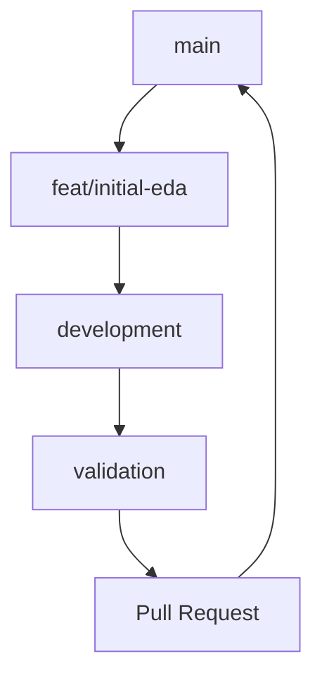
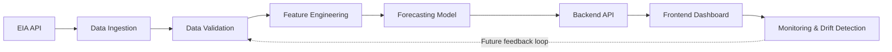

# Electricity Demand Forecasting with MLOps

> **Status: INITIAL PROJECT SCAFFOLD**

## Project Overview

Project ini menyiapkan fondasi repository untuk melakukan forecasting permintaan listrik satu jam ke depan menggunakan machine learning dan praktik MLOps. Fokus data adalah Balancing Authority **CISO** dengan frekuensi hourly UTC.

### Tujuan Awal

Tahap saat ini berfokus pada repository yang rapi, aman, dan mudah dikembangkan bersama. Struktur ini memisahkan data, konfigurasi, eksperimen notebook, reusable source code, artifact model, dokumentasi, serta komponen backend dan frontend yang akan dibuat pada tahap berikutnya.

Repository ini **belum** menjalankan data ingestion, feature engineering, model training, API, atau dashboard. Seluruh komponen tersebut masih berupa rencana arsitektur.

## Problem Statement

Kebutuhan listrik berubah dari jam ke jam. Project ini akan membangun fondasi untuk memprediksi nilai demand berikutnya agar hasil forecast dapat dipakai sebagai dasar analisis dan pengambilan keputusan operasional di masa depan.

## ML Task

- Tipe tugas: time-series regression
- Target: electricity demand pada **t+1 hour**
- Balancing Authority: **CISO**
- Metric data: **D — Demand**
- Frekuensi: hourly UTC

## Data Source

Sumber data yang direncanakan adalah [U.S. Energy Information Administration Open Data API v2](https://www.eia.gov/opendata/), menggunakan dataset *Hourly Demand, Demand Forecast, Generation, and Interchange* melalui route `electricity/rto/region-data`.

## Technology Stack

Teknologi yang direncanakan untuk tahap selanjutnya:

- Python 3.11 untuk data dan machine learning
- pandas, NumPy, scikit-learn, XGBoost, dan LightGBM
- FastAPI untuk model serving dan REST API
- React + Vite untuk dashboard
- MLflow untuk experiment tracking
- pytest untuk testing
- GitHub Actions untuk continuous integration

## Repository Structure

Struktur direktori dibagi berdasarkan tanggung jawab agar eksperimen dan kode production-ready tidak tercampur:

- `config/` menyimpan konfigurasi non-rahasia untuk data, model, dan pipeline.
- `data/` menyimpan data berdasarkan tahapnya: raw, interim, processed, dan external.
- `notebooks/` adalah lokasi untuk EDA, eksperimen, dan pemeriksaan API berbasis Jupyter.
- `src/` dicadangkan untuk reusable Python modules saat implementasi dimulai.
- `scripts/` dicadangkan untuk executable/helper scripts yang dijalankan langsung.
- `models/` menyimpan artifact model lokal yang tidak di-commit.
- `backend/` dan `frontend/` dicadangkan untuk FastAPI serta dashboard React + Vite.
- `tests/`, `docs/`, `.devcontainer/`, dan `.github/` mendukung quality checks, dokumentasi, Codespaces, dan CI.

```text
MLOps-Electricity Demand Forecasting/
├── .devcontainer/              # GitHub Codespaces configuration
├── .github/workflows/          # Continuous integration workflow
├── frontend/                   # Future React + Vite dashboard
├── backend/                    # Future FastAPI service
├── data/
│   ├── raw/                    # Source data, not committed
│   ├── interim/                # Intermediate data, not committed
│   ├── processed/              # Prepared data, not committed
│   └── external/               # External data, not committed
├── models/                     # Model artifacts, not committed
├── notebooks/                  # Experiment notebooks and future EDA
├── src/
│   ├── data/                   # Future ingestion and validation
│   ├── features/               # Future feature engineering
│   ├── models/                 # Future training, prediction, evaluation
│   ├── pipelines/              # Future orchestration
│   └── monitoring/             # Future monitoring
├── config/                     # Declarative project configuration
├── tests/                      # Future unit and integration tests
├── scripts/                    # Future operational utilities
├── docs/                       # Project documentation
├── .env.example                # Environment-variable template
├── .gitignore
├── .python-version
├── requirements.txt
├── pyproject.toml
└── README.md
```

## GitHub Codespaces

Repository ini menyediakan development container untuk GitHub Codespaces dengan Python 3.11, Node.js 20, ekstensi VS Code yang diperlukan, serta forwarded ports 8000, 5173, dan 5000.

### Menjalankan di GitHub Codespaces

1. Buka repository di GitHub.
2. Pilih **Code** > **Codespaces** > **Create codespace on main**.
3. Tunggu proses container setup selesai. Codespaces akan menjalankan perintah berikut secara otomatis:

```bash
pip install -r requirements.txt
```

4. Jika diperlukan pada tahap berikutnya, salin `.env.example` menjadi `.env` dan isi credential hanya di environment lokal Codespace.
5. Mulai bekerja dari notebook di `notebooks/` atau dokumentasi project. Port 8000, 5173, dan 5000 telah disiapkan untuk komponen masa depan.

Tidak ada backend server, frontend application, pipeline ML, atau `npm install` yang dijalankan selama setup initial scaffold ini.

## Local Development

Create and activate a virtual environment, then install the planned dependencies:

```powershell
python -m venv .venv
.\.venv\Scripts\Activate.ps1
pip install -r requirements.txt
```

This setup does not run a pipeline, model, API, or dashboard.

## Environment Variables

Copy `.env.example` to `.env` and provide the EIA API key locally:

```text
EIA_API_KEY=your_eia_api_key_here
DATABASE_URL=
```

The `.env` file is intentionally ignored by Git. Do not commit credentials.

## Security / Secret Management

Secrets are never stored in `config/`, source modules, CI configuration, or documentation. Use `.env` only for local development and keep it untracked; `.env.example` contains placeholders only.

## Branching Strategy

Project ini menggunakan GitHub Flow. Semua perubahan dibuat pada feature branch, direview melalui pull request, divalidasi oleh CI, lalu di-merge ke `main`.



Branch eksperimen pertama yang direncanakan adalah `feat/initial-eda`. Branch tersebut belum dibuat secara otomatis oleh scaffold ini.

## Data Management

Folder `data/raw`, `data/interim`, `data/processed`, dan `data/external` disiapkan untuk data pada tahap berikutnya. Isi data dan artifact model tidak di-commit; hanya file `.gitkeep` yang menjaga struktur direktori.

API key tidak ditempatkan dalam file konfigurasi. Simpan nilai rahasia hanya dalam `.env` lokal atau secret manager pada tahap deployment.

## Development Roadmap

1. Initial project scaffold — selesai pada tahap ini.
2. Exploratory data analysis — rencana berikutnya menggunakan notebook yang tersimpan di `notebooks/`.
3. Data ingestion, data validation, dan feature engineering.
4. Model training, prediction, dan evaluation.
5. Backend API dan frontend dashboard.
6. MLOps workflow, monitoring, drift detection, dan automated retraining.

## Project Architecture



Seluruh komponen pada diagram tersebut adalah arsitektur masa depan dan belum diimplementasikan pada repository ini.
