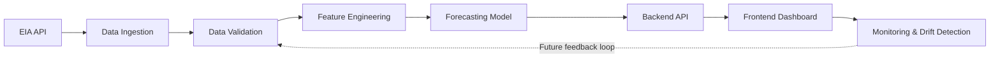

# Electricity Demand Forecasting with MLOps

> **Status:** data ingestion dan preprocessing dasar sudah tersedia; training model, API, dashboard, dan monitoring masih dalam pengembangan.

## Project Overview

Project ini membangun sistem forecasting permintaan listrik satu jam ke depan menggunakan machine learning dan praktik MLOps. Data yang digunakan adalah demand listrik **California ISO (CISO)** dengan frekuensi hourly dalam UTC.

## ML Task

- Tipe tugas: time-series regression
- Target: electricity demand pada **t+1 hour**
- Balancing Authority: **CISO**
- Metric data: **D — Demand**
- Frekuensi: hourly UTC

## Data Source

Data diambil dari [U.S. Energy Information Administration Open Data API v2](https://www.eia.gov/opendata/) melalui route `electricity/rto/region-data`. Pengumpul data meminta field `value`, respondent `CISO`, dan type `D`, kemudian mengurutkan hasil berdasarkan `period` secara ascending.

## Repository Structure

```text
MLOps-Electricity Demand Forecasting/
├── backend/                    # Future FastAPI service
├── config/                     # Konfigurasi data, model, dan pipeline
├── data/
│   ├── raw/                    # Respons API dalam format CSV
│   ├── interim/                # Data setelah preprocessing dasar
│   ├── processed/              # Data siap digunakan model
│   └── external/               # Data dari sumber eksternal lain
├── frontend/                   # Future React + Vite dashboard
├── models/                     # Model artifacts lokal
├── notebooks/                  # EDA dan eksperimen
├── scripts/                    # Lokasi utilitas operasional mendatang
├── src/
│   ├── data/                   # Client EIA dan fungsi preprocessing
│   └── pipelines/              # Entry point pengumpulan dan preprocessing data
└── tests/                      # Automated tests
```

Dokumentasi lebih rinci untuk komponen pengumpulan data tersedia di [`src/data/README.md`](src/data/README.md) dan [`src/pipelines/README.md`](src/pipelines/README.md).

## Persiapan Environment

Jalankan seluruh perintah dari root repository. Project memerlukan Python 3.11 atau yang kompatibel.

### PowerShell (Windows)

```powershell
python -m venv .venv
.\.venv\Scripts\Activate.ps1
python -m pip install -r requirements.txt
Copy-Item .env.example .env
```

### Bash (Linux, macOS, atau Codespaces)

```bash
python -m venv .venv
source .venv/bin/activate
python -m pip install -r requirements.txt
cp .env.example .env
```

Isi API key EIA di `.env`:

```dotenv
EIA_API_KEY=your_eia_api_key_here
```

API key dapat diperoleh dari halaman [EIA Open Data](https://www.eia.gov/opendata/register.php). File `.env` diabaikan oleh Git; jangan commit credential ke repository.

## Menjalankan Pengumpul Data

Sebelum eksekusi pertama, buat subfolder output. Folder ini tidak ikut di-commit karena berisi data hasil unduhan.

PowerShell:

```powershell
New-Item -ItemType Directory -Force data/raw/historical, data/raw/inference
```

Bash:

```bash
mkdir -p data/raw/historical data/raw/inference
```

### 1. Mengumpulkan data historis untuk training

```powershell
python -m src.pipelines.save_train_historical_data
```

Secara default, pipeline mengambil data per tahun mulai 2019 sampai tahun UTC saat ini. Setiap tahun dibagi menjadi dua request agar jumlah record per request tetap berada dalam batas API. File disimpan sebagai:

```text
data/raw/historical/ciso_historical_<YYYYMMDDTHHMMSSZ>.csv
```

Untuk memilih rentang tahun tertentu, panggil fungsinya secara langsung. Kedua batas tahun bersifat inklusif:

```powershell
python -c "from src.pipelines.save_train_historical_data import save_ciso_train_df; save_ciso_train_df(2022, 2024)"
```

### 2. Mengumpulkan data terbaru untuk inference

```powershell
python -m src.pipelines.save_inference_data
```

Pipeline inference meminta data mulai jam UTC saat command dijalankan dan menyimpannya sebagai:

```text
data/raw/inference/ciso_inference_<YYYYMMDDTHHMMSSZ>.csv
```

Karena publikasi data EIA dapat tertunda, respons pada jam terbaru mungkin kosong. Coba jalankan kembali setelah data tersedia.

### Verifikasi hasil

PowerShell:

```powershell
Get-ChildItem data/raw/historical, data/raw/inference -Filter *.csv
```

Bash:

```bash
find data/raw/historical data/raw/inference -name '*.csv'
```

Nama file memakai timestamp UTC agar eksekusi berikutnya tidak menimpa hasil sebelumnya. Respons HTTP yang gagal, API key yang tidak valid, atau koneksi yang timeout akan menghentikan command dan menampilkan exception.

## Preprocessing Dasar

Modul preprocessing mengubah `period` menjadi datetime UTC, mengubah `value` menjadi numerik, membuang duplikat dan nilai kosong, lalu mengurutkan data berdasarkan waktu. Untuk data training, modul juga membentuk kolom target `target_demand_1h` menggunakan demand pada baris satu jam berikutnya.

Fungsi preprocessing saat ini dipanggil dari Python dan belum mempunyai CLI tersendiri. Contoh penggunaan tersedia di [`src/pipelines/README.md`](src/pipelines/README.md).

## GitHub Codespaces

Repository menyediakan development container dengan Python 3.11. Setelah Codespace selesai dibuat, salin `.env.example` menjadi `.env`, isi `EIA_API_KEY` melalui secret Codespaces atau file lokal yang tidak di-commit, lalu jalankan modul pipeline dengan command yang sama seperti di atas.

## Security / Secret Management

Simpan secret hanya di `.env` lokal, GitHub Codespaces secrets, atau secret manager pada environment deployment. Jangan menaruh API key di `config/`, source code, notebook, CI configuration, atau dokumentasi.

## Development Roadmap

1. Initial project scaffold — selesai.
2. Exploratory data analysis — tersedia di folder `notebooks/`.
3. Data ingestion dan preprocessing dasar — sudah diimplementasikan.
4. Data validation dan feature engineering.
5. Model training, prediction, dan evaluation.
6. Backend API, frontend dashboard, monitoring, dan automated retraining.

## Project Architecture


```mermaid
flowchart LR
    EIA[EIA API] --> INGEST[Data Ingestion]
    INGEST --> VALIDATE[Data Validation]
    VALIDATE --> FEATURES[Feature Engineering]
    FEATURES --> MODEL[Forecasting Model]
    MODEL --> API[Backend API]
    API --> DASHBOARD[Frontend Dashboard]
    DASHBOARD --> MONITOR[Monitoring & Drift Detection]
    MONITOR -. Future feedback loop .-> VALIDATE
```

Saat ini bagian yang telah tersedia adalah pengambilan data dari EIA dan preprocessing dasar. Komponen sesudahnya pada diagram masih merupakan target pengembangan.
